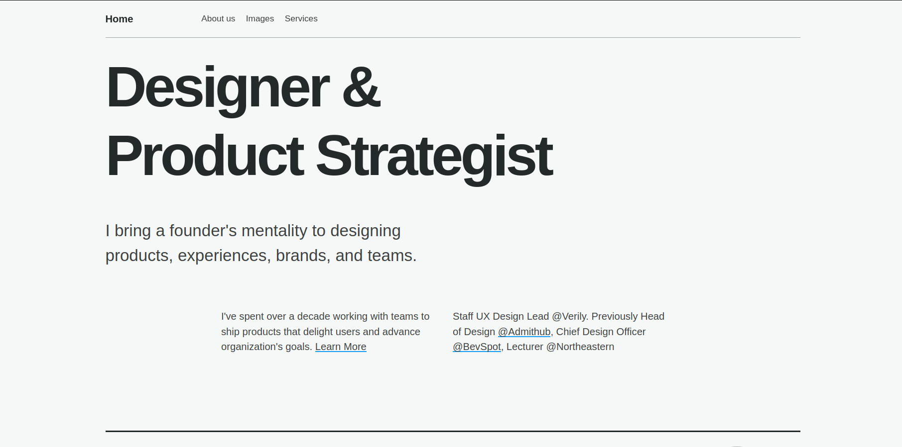
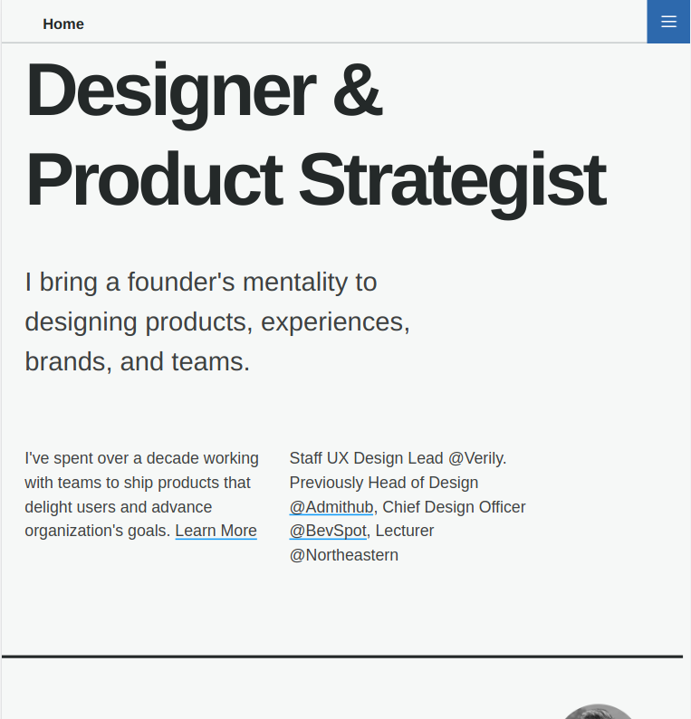
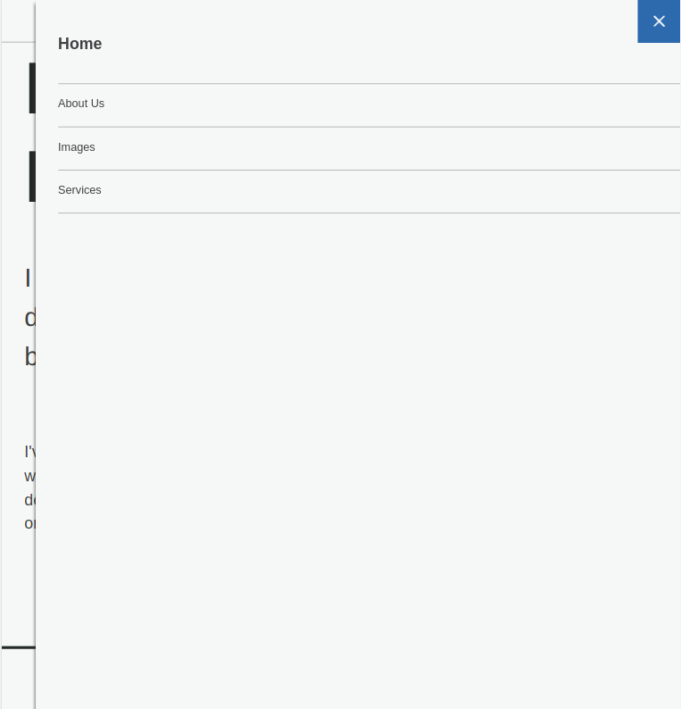

# Single Page Application

- A single-page application (SPA) is a Web app that is presented to the user through a single HTML page to be more responsive and to more closely replicate a desktop application or a native app.

- In this web there are Four tabs Home,About Us,Image (Image Slider) and Services.

## Tech Stack

- This Project is Build With Some Famous Tech And Tools Which Are Mentioned Below... 👇
  

## ScreenShot

## 🚀 Live Demonstraion

[Preview Single Page Application](https://jupinsimform.github.io/lms-SPA/)
